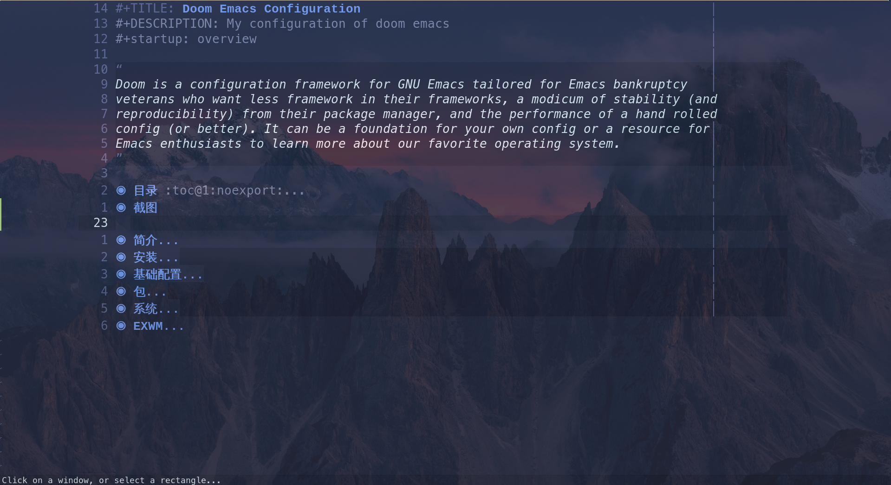
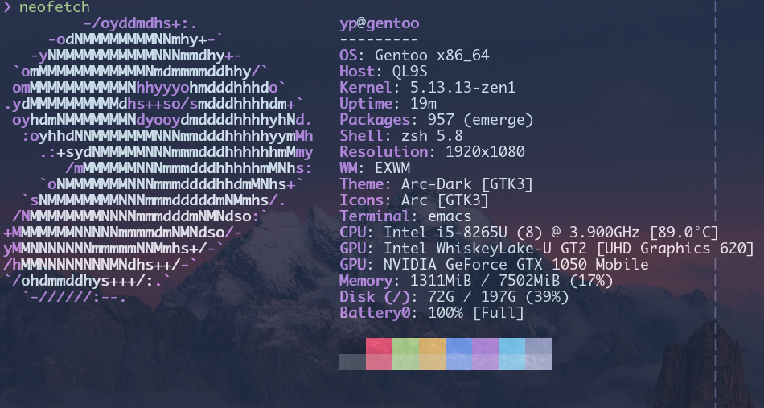

#+TITLE: Doom Emacs Configuration
#+DESCRIPTION: My configuration of doom emacs
#+STARTUP: overview

* Intro
** What is Emacs?
这部分基本上是 GNU Emacs 官方手册上的东西。
#+begin_quote
Emacs is the advanced, extensible, customizable, self-documenting editor.
This manual describes how to edit with Emacs and some of the ways to customize
it; it corresponds to GNU Emacs version 27.2.
#+end_quote
+ GNU Emacs 官方网站在 https://www.gnu.org/software/emacs/.
+ GNU Emacs 官方文档在[[https://www.gnu.org/software/emacs/manual/emacs.html][这里]]。
+ 为了扩展 Emacs, 你需要 [[https://en.wikipedia.org/wiki/Emacs_Lisp][Emacs Lisp]], 你可以在[[https://www.gnu.org/software/emacs/manual/html_mono/elisp.html][这里]]找到官方文档。

** Why Emacs?
  当我们逐一看待 Emacs 的时候，我们可以很清楚的发现它为什么被称为 *advanced*,
  *extensible*, *customizable*, *self-documenting*. 这也正是我们选择它的理由。
+ Advanced :: 它不止插入和删除文本，实际上，做普通的编辑器所不能做到的东西，
  - 音乐播放器(emms)
  - 文件管理器(dried)
  - GTD(org-mode)
  - IRC 工具
  - 新闻阅读器(atom, rss)
  - 计算器(=M-x calc=)
  - 通过 [[https://github.com/manateelazycat/emacs-application-framework][EAF]], 可以做更多事情
+ Extensible :: 很强大的扩展功能
+ Self-documenting :: 你可以在任何地方查看它的任何命令的说明
+ customizable :: 你可以很容易修改 Emacs 自身的命令

** Select a framwork
It's a huge project if you want to config emacs from scratch, so it's generally
recommaneded to choose a framework:
1. [[https://spacemacs.org][spacemacs]]
2. [[github:hlissner/doom-emacs][doom emacs]]
3. [[github:purcell/emacs.d][purcell/emacs.d]]
4. [[github:redguardtoo/emacs.d][redguardtoo/emacs.d]]
* Screenshot

* Install
** Install emacs
#+begin_src sh
emerge -av emacs
#+end_src
** Install Doom Emacs
#+begin_src sh
[ -f "~/.emacs.d" ] && mv ~/.emacs.d ~/.emacs.bak
git clone -depth=1 https://github.com/hilssner/doom-emacs ~/.emacs.d
~/.emacs.d/bin/doom install
#+end_src
** Install My Configfile
First clone this repository.
#+begin_src sh
git clone --depth=1 https://github.com/ypcodes/.doom.d.git
#+end_src

Next, run =doom sync=.
#+begin_src sh
~/.emacs.d/bin/doom sync
#+end_src

* Basic Configuration
** Lexical Binding
#+begin_src emacs-lisp :tangle yes
;;; config.el - doom emacs config file. -*- lexical-binding: t -*-
#+end_src

#+begin_src emacs-lisp :tangle packages.el
;;; packages.el - doom emacs packages file. -*- lexical-binding: t -*-
#+end_src
** Exit emacs without confirm
#+begin_src emacs-lisp :tangle yes
(setq confirm-kill-emacs nil
      confirm-kill-processes nil)

#+end_src
** Startup Performace
#+begin_src emacs-lisp :tangle yes

;; The default is 800 kilobytes.  Measured in bytes.
(setq gc-cons-threshold (* 50 1000 1000))

;; Profile emacs startup
(add-hook 'emacs-startup-hook
          (lambda ()
            (message "*** Emacs loaded in %s with %d garbage collections."
                     (format "%.2f seconds"
                             (float-time
                              (time-subtract after-init-time before-init-time)))
                     gcs-done)))

#+end_src
** Input Method
I am using rime for my default input method.
#+begin_src emacs-lisp :tangle yes
(setq default-input-method "rime")
#+end_src
** User name and email
#+begin_src emacs-lisp :tangle yes
(setq user-full-name "Ye Peng"
      user-mail-address "yemouren@protonmail.com")
#+end_src
** Fullscreen when start
#+begin_src emacs-lisp :tangle yes
(toggle-frame-fullscreen)
#+end_src
** custom.el
#+begin_src emacs-lisp :tangle yes
(setq-default custom-file (expand-file-name ".custom.el" doom-private-dir))
(when (file-exists-p custom-file)
  (load custom-file))
;; (setq pdf-view-midnight-colors '("#839496" . "#002b36" ))
#+end_src
** Display line number
#+begin_src emacs-lisp :tangle yes
(setq display-line-numbers-type t)
#+end_src

** UI
*** Display battery and time on modeline
#+begin_src emacs-lisp :tangle yes
(display-time-mode t)
(display-battery-mode 1)
#+end_src
*** Emacs opacity
#+begin_src emacs-lisp :tangle yes
(doom/set-frame-opacity '78)
(set-frame-parameter (selected-frame) 'alpha '(78 80))
(add-to-list 'default-frame-alist '(alpha 78 80))
#+end_src
*** Set theme
#+begin_src emacs-lisp :tangle yes
;; (setq doom-theme 'doom-city-lights)
#+end_src
*** Set font
#+begin_src emacs-lisp :tangle yes
(setq doom-font (font-spec :family "FiraCode Nerd Font" :size 22  :weight 'semi-light)
      doom-variable-pitch-font (font-spec :family "Menlo" :size 22)
      doom-unicode-font (font-spec :family "FiraCode Nerd Font" :size 22)
      )
#+end_src

*** Set fill-column
#+begin_src emacs-lisp :tangle yes
(setq-default fill-column 80)
;; 显示
(add-hook 'doom-first-buffer-hook
          #'global-display-fill-column-indicator-mode)
#+end_src

** Scratch buffer
Use orgmode as major mode of =*scratch* buffer=
#+begin_src emacs-lisp :tangle yes
(setq initial-major-mode 'org-mode)

#+end_src
 Display a poem in  ~scratch~ buffer
#+begin_src emacs-lisp :tangle yes
(defvar poem-file "~/.doom.d/.poem.json")
(defvar poem-cache nil)

(defun poem-update ()
  "Download poem from `jinrishici.com`"
  (let ((url-request-extra-headers
         '(("X-User-Token" . "GCd0PV8D3AcSQiJSy63beQeGt9JtG0Vz"))))
    (ignore-errors
      (url-retrieve
       "https://v2.jinrishici.com/sentence"
       (lambda (status)
	 (write-region url-http-end-of-headers (point-max) poem-file)))))
  (setq poem-cache nil))

(defun poem-get (prop)
  "Get poem from cache file, PROP can be 'content, 'origin"
  (ignore-errors
    (if poem-cache
        (alist-get prop poem-cache)
      (with-temp-buffer
        (insert-file-contents poem-file)
        (let ((data (alist-get 'data (json-read))))
          (setq poem-cache data)
          (alist-get prop data))))))

(defun poem-get-formatted ()
  (let* ((poem (poem-get 'origin))
         (lines (alist-get 'content poem))
         (content (mapconcat #'identity lines "\n")))
    (format "%s\n%s · %s\n%s"
            (alist-get 'title poem)
            (alist-get 'dynasty poem)
            (alist-get 'author poem)
            content)))

(add-hook 'emacs-startup-hook 'poem-update)
(setq initial-scratch-message
      (poem-get-formatted))
#+end_src

** Start server
#+begin_src emacs-lisp :tangle yes
(server-start)
#+end_src
** Dired
#+begin_src emacs-lisp :tangle yes
;; W 用 `xdg-open' 打开文件
(setq browse-url-handlers '(("\\`file:" . browse-url-default-browser)))
#+end_src
* Packages
** org mode
*** Basics
#+begin_src emacs-lisp :tangle yes
(use-package! org
  :hook ((org-mode . org-superstar-mode)
         (org-mode . org-num-mode)
         )
  :config
  (setq org-hide-emphasis-markers t)
  (setq org-directory "~/org/")
  )
#+end_src
*** Org Jounal
#+begin_src emacs-lisp :tangle yes
(use-package! org-journal
  :init
  (setq org-journal-dir "~/org/Daily"
        org-journal-date-prefix "#+TITLE: "
        org-journal-file-format "%Y-%m-%d.org"
        org-journal-date-format "%A, %d %B %Y")
  :config
  (setq org-journal-find-file #'find-file-other-window )
  (map! :map org-journal-mode-map
        "C-c n s" #'evil-save-modified-and-close )
  (setq org-journal-enable-agenda-integration t))
#+end_src
*** Deft
You should comment the section when running ~doom doctor~
#+begin_src emacs-lisp :tangle yes
(use-package! deft
  :config
  (setq deft-directory "~/org"
        deft-extensions '("org")
        deft-use-filter-string-for-filename t
        deft-recursive t
        ))
#+end_src
*** Org agneda
#+begin_src emacs-lisp :tangle packages.el
(package! org-super-agenda)
#+end_src
#+begin_src emacs-lisp :tangle yes
(use-package! org-super-agenda
  :after org-agenda
  :config
  (setq org-super-agenda-groups
        '(;; Each group has an implicit boolean OR operator between its selectors.
          (:name "Today"               ; Optionally specify section name
           :time-grid t                ; Items that appear on the time grid
           :todo "TODAY")              ; Items that have this 'TODO' keyword
          (:name "Important"
           ;; Single arguments given alone
           :tag "bills"
           :priority "A")
          ;; Set order of multiple groups at once
          (:order-multi (2 (:name "Shopping in town"
                            ;; Boolean AND group matches items that match all subgroups
                            :and (:tag "shopping" :tag "@town"))
                           (:name "Food-related"
                            ;; Multiple args given in list with implicit OR
                            :tag ("food" "dinner"))
                           (:name "Personal"
                            :habit t
                            :tag "personal")
                           (:name "Space-related (non-moon-or-planet-related)"
                            ;; Regexps match case-insensitively on the entire entry
                            :and (:regexp ("space" "NASA")
                                  ;; Boolean NOT also has implicit OR between selectors
                                  :not (:regexp "moon" :tag "planet")))))
          ;; Groups supply their own section names when none are given
          (:todo "WAITING" :order 8)   ; Set order of this section
          (:todo ("SOMEDAY" "TO-READ" "CHECK" "TO-WATCH" "WATCHING" "NOTE")
           ;; Show this group at the end of the agenda (since it has the
           ;; highest number). If you specified this group last, items
           ;; with these todo keywords that e.g. have priority A would be
           ;; displayed in that group instead, because items are grouped
           ;; out in the order the groups are listed.
           :order 9)
          (:priority<= "B"
           ;; Show this section after "Today" and "Important", because
           ;; their order is unspecified, defaulting to 0. Sections
           ;; are displayed lowest-number-first.
           :order 1))))
#+end_src
*** org media note
#+begin_src emacs-lisp :tangle packages.el
(package! org-media-note
  :recipe (:host github
           :repo "yuchen-lea/org-media-note"))
(package! mpv)
(package! major-mode-hydra)
#+end_src
#+begin_src emacs-lisp :tangle yes
(use-package! org-media-note
  :hook (org-mode .  org-media-note-mode)
  :config
  (setq org-media-note-screenshot-image-dir "~/imgs/orgmedia")  ;; 用于存储视频截图的目录
  (map! :leader
        :desc "Open org-media body"
        :after org-mode
        :v "m v" 'org-media-note-hydra/pretty-body)
  )
#+end_src
*** org pomodoro
#+begin_src emacs-lisp :tangle yes
(use-package! org-pomodoro
  :config
  (setq org-pomodoro-length '45))
#+end_src
*** org drill
Flash card for studying
#+begin_src emacs-lisp :tangle packages.el
(package! org-drill)
#+end_src
*** org-fancy-priorities
#+begin_src emacs-lisp :tangle yes
(add-hook 'org-agenda-mode-hook 'org-fancy-priorities-mode)
#+end_src
*** org-alert
#+begin_src emacs-lisp :tangle packages.el
(package! org-alert)
#+end_src
#+begin_src emacs-lisp :tangle yes
(use-package! org-alert
  :config
  (setq alert-default-style 'notifications)
  (org-alert-enable)
)
#+end_src

** whichkey
#+begin_src emacs-lisp :tangle yes
(after! whichkey
  :config
  (setq which-key-idle-delay 0.5))
#+end_src
** pretty mode
#+begin_src emacs-lisp :tangle packages.el
(package! pretty-mode)
#+end_src
#+begin_src emacs-lisp :tangle yes
(add-hook! (org-mode cc-mode emacs-lisp-mode python-mode sh-mode)
  (pretty-mode))
(add-hook 'after-init-hook 'prettify-symbols-mode)
#+end_src
** rainbow mode
#+begin_src emacs-lisp :tangle yes
(add-hook 'emacs-startup-mode
  'rainbow-delimiters-mode)
(add-hook! 'rainbow-mode-hook
  (hl-line-mode (if rainbow-mode -1 +1)))
#+end_src
** company mode
#+begin_src emacs-lisp :tangle yes
(after! company
  (setq! company-minimum-prefix-length 2
         company-idle-delay 0.5))
#+end_src
** valign
#+begin_src emacs-lisp :tangle packages.el
(package! valign)
#+end_src
#+begin_src emacs-lisp :tangle yes
(use-package! valign
  :config
  (add-hook 'org-mode-hook #'valign-mode))
#+end_src
** super save
#+begin_src emacs-lisp :tangle packages.el
(package! super-save)
#+end_src
#+begin_src emacs-lisp :tangle yes
(use-package! super-save
  :config
  (super-save-mode +1)
  (setq auto-save-default t)
  (setq super-save-auto-save-when-idle t)
  (add-to-list 'super-save-triggers 'ace-window)
  ;; save on find-file
  (add-to-list 'super-save-hook-triggers 'find-file-hook))
#+end_src

** pangu-spacing
#+begin_src emacs-lisp :tangle packages.el
(package! pangu-spacing)
#+end_src
#+begin_src emacs-lisp :tangle yes
(use-package! pangu-spacing
  :hook (after-init . global-pangu-spacing-mode))
#+end_src

** evil
#+begin_src emacs-lisp :tangle yes
(use-package! evil
  :config
  (defalias 'evil-insert-state 'evil-emacs-state)
  (define-key evil-emacs-state-map (kbd "<escape>") 'evil-normal-state)
  (setq evil-emacs-state-cursor 'bar))
#+end_src
** format on save
#+begin_src emacs-lisp :tangle yes
(setq +format-on-save-enabled-modes
      '(not sql-mode                      ; sqlformat is currently broken
            tex-mode                      ; latex-indent is broken
            latex-mode))
#+end_src
** laas
#+begin_src emacs-lisp :tangle packages.el
(package! laas)
#+end_src

#+begin_src emacs-lisp :tangle yes
(use-package! laas
  :hook
  (LaTeX-mode . laas-mode)
  (org-mode . laas-mode)
  :config                               ; do whatever here
  (aas-set-snippets 'laas-mode
                    ;; set condition!
                    :cond #'texmathp    ; expand only while in math
                    "supp" "\\supp"
                    "On" "O(n)"
                    "O1" "O(1)"
                    "Olog" "O(\\log n)"
                    "Olon" "O(n \\log n)"
                    ;; bind to functions!
                    "Sum" (lambda () (interactive)
                            (yas-expand-snippet "\\sum_{$1}^{$2} $0"))
                    "Span" (lambda () (interactive)
                             (yas-expand-snippet "\\Span($1)$0"))))

#+end_src

** emcas-rime
#+begin_src emacs-lisp :tangle packages.el
(package! rime)
#+end_src

#+begin_src emacs-lisp :tangle yes
(use-package! rime
  :config
  (setq rime-user-data-dir "~/.config/fcitx/rime")
  (setq rime-posframe-properties
        (list :background-color "#333333"
              :foreground-color "#dcdccc"
              :font "WenQuanYi Micro Hei Mono-15"
              :internal-border-width 10))
  (setq rime-show-candidate 'posframe)
  (setq rime-inline-ascii-trigger 'shift-l)
  (define-key rime-mode-map (kbd "M-j") 'rime-force-enable)
  (setq mode-line-mule-info '((:eval (rime-lighter))))
  (setq rime-disable-predicates
        '(rime-predicate-evil-mode-p
          rime-predicate-after-alphabet-char-p
          rime-predicate-prog-in-code-p
          rime-predicate-after-alphabet-char-p))
  )
#+end_src
** vterm
*** Configure
#+begin_src emacs-lisp :tangle yes
(use-package! vterm
  :config
  (define-key vterm-mode-map (kbd "<C-backspace>")
    (lambda () (interactive) (vterm-send-key (kbd "C-w"))))
  (push (list "find-file-below"
              (lambda (path)
                (if-let* ((buf (find-file-noselect path))
                          (window (display-buffer-below-selected buf nil)))
                    (select-window window)
                  (message "Failed to open file: %s" path))))
        vterm-eval-cmds)
  (add-hook 'vterm-mode-hook #'evil-collection-vterm-escape-stay)

  ;; fonts
  (defface my-vterm-font
    '((t :family "FiraCode Nerd Font" :size 22))
    "FiraCode Nerd Font"
    :group 'basic-faces)
  (add-hook 'vterm-mode-hook
            (lambda ()
              (set (make-local-variable 'buffer-face-mode-face) 'my-vterm-font)
              (buffer-face-mode t)))

  )
#+end_src
** Multi-vterm
*** Install
#+begin_src emacs-lisp :tangle packages.el
(package! multi-vterm)
#+end_src
*** Configure
#+begin_src emacs-lisp :tangle yes
(use-package! multi-vterm
	:config
	(evil-define-key 'normal vterm-mode-map (kbd ",c")       #'multi-vterm)
	(evil-define-key 'normal vterm-mode-map (kbd ",n")       #'multi-vterm-next)
	(evil-define-key 'normal vterm-mode-map (kbd ",p")       #'multi-vterm-prev)
)
#+end_src
** vimrc
*** Install
#+begin_src emacs-lisp :tangle packages.el
(package! vimrc-mode)
#+end_src
** undo tree
*** Configuration
#+begin_src emacs-lisp :tangle yes
(add-hook 'emacs-startup-hook 'global-undo-tree-mode)
(after! undo-tree
  (setq undo-tree-auto-save-history nil))

#+end_src
** calendar
*** Install
#+begin_src emacs-lisp :tangle packages.el
(package! cal-china-x)
#+end_src
*** Configure
#+begin_src emacs-lisp :tangle yes
(use-package! org-agenda
  :config
  ;; (require 'cl-china)
  ;; diary for chinese birthday
  (defun my--diary-chinese-anniversary (lunar-month lunar-day &optional year mark)
    (if year
        (let* ((d-date (diary-make-date lunar-month lunar-day year))
               (a-date (calendar-absolute-from-gregorian d-date))
               (c-date (calendar-chinese-from-absolute a-date))
               (date a-date)
               (cycle (car c-date))
               (yy (cadr c-date))
               (y (+ (* 100 cycle) yy)))
          (diary-chinese-anniversary lunar-month lunar-day y mark))
      (diary-chinese-anniversary lunar-month lunar-day year mark)))
;;; 补充用法: holiday-float m w n 浮动阳历节日, m 月的第 n 个星期 w%7
  (setq general-holidays '((holiday-fixed 1 1   "元旦")
                           (holiday-fixed 2 14  "情人节")
                           (holiday-fixed 4 1   "愚人节")
                           (holiday-fixed 12 25 "圣诞节")
                           (holiday-fixed 10 1  "国庆节")
                           (holiday-float 5 0 2 "母亲节")   ;5月的第二个星期天
                           (holiday-float 6 0 3 "父亲节")
                           ))
  (setq local-holidays '((holiday-chinese 1 15  "元宵节 (正月十五)")
                         (holiday-chinese 5 5   "端午节 (五月初五)")
                         (holiday-chinese 9 9   "重阳节 (九月初九)")
                         (holiday-chinese 8 15  "中秋节 (八月十五)")
                         ;; 生日
                         (holiday-chinese 10 22 "爸爸生日")
                         (holiday-chinese 3 25  "妈妈生日")
                         (holiday-chinese 1 2 "生日")

                         (holiday-lunar 1 1 "春节" 0)
                         ))
  (use-package! cal-china-x
    :config
    (setq mark-holidays-in-calendar t)
    (setq cal-china-x-important-holidays cal-china-x-chinese-holidays)
    (setq cal-china-x-general-holidays '((holiday-lunar 1 15 "元宵节")))
    (setq calendar-holidays
          (append cal-china-x-important-holidays
                  cal-china-x-general-holidays))
    )
  ;; Month
  (setq calendar-month-name-array
        ["1月" "2月" "3月"     "4月"   "5月"      "6月"
         "7月"    "8月"   "9月" "10月" "11月" "12月"])

  ;; Week days
  (setq calendar-day-name-array
        ["星期天" "星期一" "星期二" "星期三" "星期四" "星期五" "星期六"])

  ;; First day of the week
  (setq calendar-week-start-day 0) ; 0:Sunday, 1:Monday
  )
#+end_src
** ampc
*** Install
#+begin_src emacs-lisp :tangle packages.el
(package! ampc)
#+end_src

*** Configure
#+begin_src emacs-lisp :tangle yes
(use-package! ampc
  :config
  (setq ampc-tagger-music-directories "~/Music"))
#+end_src
** volume
*** Install
#+begin_src emacs-lisp :tangle packages.el
(package! volume)
#+end_src
*** Configure
#+begin_src emacs-lisp :tangle yes
(use-package! volume)
#+end_src
** dash docs
#+begin_src emacs-lisp :tangle yes
(use-package! dash-docs
  :config
  (setq dash-docs-browser-func 'browse-url))
#+end_src
** spell
#+begin_src emacs-lisp :tangle yes
(set-buffer-file-coding-system 'utf-8)
#+end_src
** nerd-fonts
*** Install
#+begin_src emacs-lisp :tangle packages.el
(package! nerd-fonts
  :recipe (:host github
           :repo "twlz0ne/nerd-icons.el"))
#+end_src
** grammar
#+begin_src emacs-lisp :tangle yes
(setq langtool-language-tool-jar "/usr/share/languagetool/lib/languagetool-commandline.jar")
#+end_src
** eshell
*** Alias
**** Custom
#+begin_src emacs-lisp :tangle yes
(set-eshell-alias!
 "yt" "youtube-dl $*"
 "yta" "youtube-dl -x -f bestaudio/best $*"
 "gcl" "git clone --depth=1 $*"
 "open" "xdg-open $*"
 "xo" "xdg-open $*"
 "g" "git --no-pager $*"
 "c" "clear-scrollback"
 "ee" "sudo emerge $*"
 )
#+end_src
**** Load bash alias
***** Install
#+begin_src emacs-lisp :tangle packages.el
(package! load-bash-alias)
#+end_src
***** Configuration
#+begin_src emacs-lisp :tangle yes
(use-package! load-bash-alias
  :config
  (setq load-bash-alias-bashrc-file "~/.zshrc")
  (setq load-bash-alias-exclude-aliases-regexp "^alias")
  )
#+end_src

*** Autosuggestions
**** Install
#+begin_src emacs-lisp :tangle packages.el
(package! esh-autosuggest)
#+end_src
**** Configuration
#+begin_src emacs-lisp :tangle yes
(use-package! esh-autosuggest
  :config
  (add-hook 'eshell-mode-hook #'esh-autosuggest-mode)
  )
#+end_src
*** Keybinding
#+begin_src emacs-lisp :tangle yes
(after! esh-mode
  (map! :map eshell-mode-map
        "C-l"   #'eshell/clear))

#+end_src
*** eshell-info-banner
**** Install
#+begin_src emacs-lisp :tangle packages.el
(package! eshell-info-banner
  :recipe (:host github
           :repo "phundrak/eshell-info-banner.el"))
#+end_src
**** Configuration
#+begin_src emacs-lisp :tangle yes
(use-package! eshell-info-banner
  :hook ((eshell-mode . eshell-info-banner)
         (eshell-banner-load . eshell-info-banner-update-banner)))
#+end_src
*** eshell-bookmarks
#+begin_src emacs-lisp :tangle packages.el
(package! eshell-bookmark)
#+end_src
#+begin_src emacs-lisp :tangle yes
(use-package! eshell-bookmark
  :after eshell
  :config
  (add-hook 'eshell-mode-hook #'eshell-bookmark-setup))
#+end_src
** RSS
#+begin_src emacs-lisp :tangle yes
(setq elfeed-feeds
      '("https://blog.yemouren.com/index.xml"
        "https://feeds.feedburner.com/ruanyifeng"
        ))
#+end_src
** ebuild mode
#+begin_src emacs-lisp :tangle packages.el
(package! ebuild-mode)
(package! justify-kp
  :recipe (:host github
           :repo "Fuco1/justify-kp"))
#+end_src
#+begin_src emacs-lisp :tangle yes
(use-package! ebuild-mode
  :init (add-to-list 'auto-mode-alist '("\\.ebuild\\'" . ebuild-mode))
  (require 'justify-kp)
(setq nov-text-width t)

(defun my-nov-window-configuration-change-hook ()
  (my-nov-post-html-render-hook)
  (remove-hook 'window-configuration-change-hook
               'my-nov-window-configuration-change-hook
               t))

(defun my-nov-post-html-render-hook ()
  (if (get-buffer-window)
      (let ((max-width (pj-line-width))
            buffer-read-only)
        (save-excursion
          (goto-char (point-min))
          (while (not (eobp))
            (when (not (looking-at "^[[:space:]]*$"))
              (goto-char (line-end-position))
              (when (> (shr-pixel-column) max-width)
                (goto-char (line-beginning-position))
                (pj-justify)))
            (forward-line 1))))
    (add-hook 'window-configuration-change-hook
              'my-nov-window-configuration-change-hook
              nil t)))

(add-hook 'nov-post-html-render-hook 'my-nov-post-html-render-hook)

  )
#+end_src
** nov
*** Install
#+begin_src emacs-lisp :tangle packages.el
(package! nov)
#+end_src
*** Configuration
#+begin_src emacs-lisp :tangle yes
(use-package! nov
  :init (add-to-list 'auto-mode-alist '("\\.epub\\'" . nov-mode))
  :config
  (add-hook 'nov-mode-hook '(lambda ()
                              (face-remap-add-relative
                               'variable-pitch
                               :family "FiraCode Nerd Font"
                               :height 1.0)))
  (setq nov-text-width 80)
  )
#+end_src
** Magit
#+begin_src emacs-lisp :tangle yes
(use-package! magit
  :config
  (setq magit-repository-directories (concat (getenv "HOME") "/Project/"))
)
#+end_src
** Random theme
#+begin_src emacs-lisp :tangle packages.el
(package! random-theme
  :recipe (:host github
           :repo "gopar/rand-theme"))
#+end_src

#+begin_src emacs-lisp :tangle yes
(use-package! rand-theme
  :config
  (setq rand-theme-unwanted '(leuven tango adwaita light-blue
                                     tsdh-light
                                     dichromacy
                                     whiteboard
                                     doom-one-light
                                     doom-nord-light
                                     doom-opera-light
                                     doom-ayu-light
                                     doom-gruvbox-light
                                     doom-solarized-light
                                     doom-acario-light
                                     ))
  (rand-theme)
  )
#+end_src

* System
** Commands
#+begin_src emacs-lisp :tangle yes
(defun yp/shutdown ()
  (interactive)
  (shell-command "sudo shutdown -h now"))

(defun yp/reboot ()
  (interactive)
  (shell-command "sudo reboot"))

(defun yp/logout ()
  (interactive)
  (kill-emacs))

(defun yp/display-off ()
  (interactive)
  (shell-command "xset dpms force off"))

(defun yp/lock-screen ()
  "Lock screen using (zone) and xtrlock
 calls M-x zone on all frames and runs xtrlock"
  (interactive)
  (save-excursion
    (set-process-sentinel
     (start-process "xtrlock" nil "xtrlock")
     '(lambda (process event)
        (zone-leave-me-alone)))
    (zone-when-idle 1)))

(defun yp/screenshot-full ()
  (interactive)
  (shell-command "scrot ~/Pictures/screenshot/pic-$(date '+%y%m%d-%H%M-%S').png"))

(defun yp/screenshot-current-window ()
  (interactive)
  (shell-command "scrot -f ~/Pictures/screenshot/pic-$(date '+%y%m%d-%H%M-%S').png"))

(defun yp/screenshot-select ()
  (interactive)
  (shell-command "scrot --select ~/Pictures/screenshot/pic-$(date '+%y%m%d-%H%M-%S').png"))

(defun yp/screenshot-clip
  (interactive)
  (shell-command "scrot -e 'xclip -selection clipboard -t image/png -i $f' -s")
  )

(defun sync-website ()
  (interactive)
  (cd "~/Project/blog")
  (delete-directory "~/Project/blog/public" t)
  (shell-command "hugo -D")
  (shell-command "rsync --archive --compress --verbose --human-readable --progress ~/Project/blog/public/* root@yemouren.com:/var/www/blog/")
  (cd "~/org/blogs")
  )
#+end_src
** Re-tangle codes
对于在 =~/dotfiles= 内的 org 文件，自动导出代码。
#+begin_src emacs-lisp :tangle yes
(defun yp/tangle-dotfiles ()
  "If the current file is in '~/dotfiles', the code blocks are tangled"
  (when (equal (file-name-directory buffer-file-name)
               (concat (getenv "HOME") "/dotfiles/"))
    (org-babel-tangle)
    (message "%s tangled" buffer-file-name)))
(add-hook 'after-save-hook 'yp/tangle-dotfiles)
#+end_src
** Envirement varibles

Set PATH
#+begin_src emacs-lisp :tangle yes
(setenv "PATH" (concat (getenv "PATH") ":" (concat (getenv "HOME") "/.emacs.d/bin") ":/usr/lib/go/bin"))
#+end_src

Set proxy
#+begin_src emacs-lisp :tangle yes
(setenv "http_proxy" "http://127.0.0.1:7890")
(setenv "https_proxy" "http://127.0.0.1:7890")
#+end_src

Fcitx settings
#+begin_src emacs-lisp :tangle yes
(setenv "GTK_IM_MODULE" "fcitx")
(setenv "QT_IM_MODULE" "fcitx")
(setenv "XMODIFIERS" "@im=fcitx")
#+end_src

Set doomdir
#+begin_src emacs-lisp :tangle yes
(setenv "DOOMDIR" (concat (getenv "HOME") "/.doom.d"))
#+end_src

Set CDPATH
#+begin_src emacs-lisp :tangle yes
(setenv "CDPATH" "")
#+end_src

Set winearch
#+begin_src emacs-lisp :tangle yes
(setenv "WINEARCH" "win32")
#+end_src

** Startup tools
#+begin_src emacs-lisp :tangle yes
(start-process-shell-command "xcompmgr" nil "xcompmgr")
(start-process-shell-command "nm-applet" nil "nm-applet")
(start-process-shell-command "fcitx" nil "fcitx")
(start-process-shell-command "unclutter" nil "unclutter")
(start-process-shell-command "dunst" nil "dunst")
(start-process-shell-command "mpd" nil "mpd")
(start-process-shell-command "clash" nil "clash")
(start-process-shell-command "espanso" nil "espanso start")
(shell-command "xrdb -merge ~/.config/x11/Xresources")
(shell-command "setxkbmap -option 'ctrl:nocaps'")
(shell-command "xcape -e 'Control_L=Escape'")
(shell-command "xset r rate 200 100")
#+end_src
* EXWM
Exwm is a window manager based on emacs.
** Install
#+begin_src emacs-lisp :tangle packages.el
(package! exwm)
(package! xelb)
#+end_src
** Configration
*** Wallpaper
**** Install
#+begin_src emacs-lisp :tangle packages.el
(package! wallpaper)
#+end_src
**** Set wallpaper
#+begin_src emacs-lisp :tangle yes
(use-package! wallpaper
  :hook ((exwm-randr-screen-change . wallpaper-set-wallpaper)
         (after-init . wallpaper-cycle-mode))
  :custom ((wallpaper-cycle-single t)
           (wallpaper-scaling 'scale)
           (wallpaper-cycle-interval 450)
           (wallpaper-cycle-directory "~/Pictures/Wallpaper"))
  :config
  (unless (executable-find "feh")
    (display-warning 'wallpaper "External command `feh' not found!")))
#+end_src
*** Configuration
#+begin_src emacs-lisp :tangle yes
(use-package! exwm
  :config
  ;; (define-obsolete-function-alias 'exwm-config-default
  ;;   #'exwm-config-example "27.1")
  (defun launch-terminal ()
    (interactive)
    (+eshell/here))

  (setq exwm-workspace-number 5)
  ;; Make class name the buffer name
  (add-hook 'exwm-update-class-hook
            (lambda ()
              (exwm-workspace-rename-buffer exwm-class-name)))

  (setq exwm-input-global-keys
        `(
          ;; 's-r': Reset (to line-mode).
          ([?\s-r] . exwm-reset)
          ;; 's-w': Switch workspace.
          ([?\s-t] . exwm-workspace-switch)
          ;; 's-d': Launch application.
          ([?\s-d] . (lambda (command)
                       (interactive (list (read-shell-command "$ ")))
                       (start-process-shell-command command nil command)))
          ([?\s-=] . volume-raise)
          ([?\s--] . volume-lower)

          ([?\s-w] . (lambda ()
                       (interactive)
                       (start-process-shell-command "Brave-browser" nil "brave-bin")))

          ;; 's-N': Switch to certain workspace.
          ,@(mapcar (lambda (i)
                      `(,(kbd (format "s-%d" i)) .
                        (lambda ()
                          (interactive)
                          (exwm-workspace-switch-create ,i))))
                    (number-sequence 0 9))))
  (let ((workspace-numbers (number-sequence 0 9))
        (keys ")!@#$%^&*("))
    (seq-doseq (num workspace-numbers)
                (let* ((idx num)
                       (key (aref keys idx)))
                  (exwm-input-set-key (kbd (format "s-%c" key))
                                      `(lambda ()
                                         (interactive)
                                         (exwm-workspace-move-window , num)))))
    )
  ;; Line-editing shortcuts
  (setq exwm-input-simulation-keys
        '(([?\C-b] . [left])
          ([?\C-f] . [right])
          ([?\C-p] . [up])
          ([?\C-n] . [down])
          ([?\C-a] . [home])
          ([?\C-e] . [end])
          ([?\M-v] . [prior])
          ([?\C-v] . [next])
          ([?\C-d] . [delete])
          ([?\C-k] . [S-end delete])))
  ;; Enable EXWM
  (exwm-enable)

  ;; maps
  (map! :desc "Open Terminal"
        :g "s-<return>"  'launch-terminal)

(map! :desc "Screenshot fullscreen"
      :g "<print>" 'yp/screenshot-full
      :g "S-<print>" 'yp/screenshot-select
      :g "C-<print>" 'yp/screenshot-current-window
      )
)
#+end_src
*** Window Class
#+begin_src emacs-lisp :tangle yes
(setq exwm-manage-configurations
      '(((equal exwm-class-name "mpv")
         floating t
         floating-mode-line nil
         width 0.6
         height 0.8
         )
        ((equal exwm-class-name "Brave-browser")
         workspace 1
         char-mode t)
        ((equal exwm-class-name "Google-chrome")
         char-mode t)
        ((equal exwm-class-name "phototshop.exe")
         char-mode t)
        ((equal exwm-class-name "St")
         char-mode t)
        ((equal exwm-class-name "discord")
         workspace 3)
        ((equal exwm-class-name "Gpick")
         floating t
         floating-mode-line nil
         width 0.4
         height 0.5)
      )
    )

(add-hook 'exwm-floating-setup-hook
          (lambda ()
            (exwm-layout-hide-mode-line)
            (setq floating-mode-line nil)))
;; Make buffer name more meaningful
(add-hook 'exwm-update-class-hook
          (lambda ()
          (exwm-workspace-rename-buffer exwm-class-name)))
#+end_src

** Start Exwm
#+begin_src emacs-lisp :tangle yes
(require 'exwm)
(require 'exwm-config)
(exwm-enable)
;; (require 'exwm-systemtray)
;; (exwm-systemtray-enable)
#+end_src

